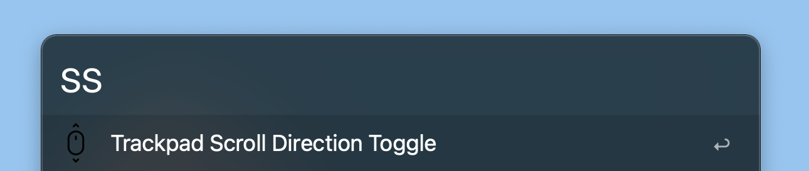

# alfred-scroll-toggler

키보드를 사용할 때와 트랙패드를 사용할 때, 맥 설정의 스크롤 방향을 'ss' 키워드로 바로 바꿔주는 workflow 입니다.

맥북에 마우스를 연결해서 사용할 시 트랙패드 스크롤 방향이 반대로 설정되어있는 경우가 있습니다. 그 때 alfred를 사용해 ss 명령어 하나로 스크롤 방향을 자연스럽게 변경시킬 수 있습니다.
마우스를 사용하지 않고 다시 트랙패드를 사용해야할 때, 한번 더 명령을 하면 스크롤 방향이 원래대로 돌아옵니다.
appleScript를 사용하였으며, Mac 설정 language가 Korean일 경우에만 동작합니다. 만약 language가 US로 설정되어 있다면, workflow 내 appleScript의 System Preference 명칭이 한글로 되어있는 부분을 영문으로 변경해 주면 됩니다.

[Download](https://github.com/pozafly/alfred-scroll-toggler/raw/master/src/scroll-toggler.alfredworkflow)
